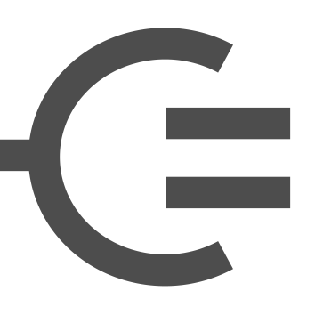

Mule CoAP connector is an implementation of the [RFC7252 - Constrained Application Protocol](http://tools.ietf.org/html/rfc7252) as a Anypoint Connector. 
With it Mule applications become CoAP capable and can communicate with other CoAP capable devices and services, realising IoT solutions. 

The connector uses Californium, a Java CoAP implementation. More information about Californium and CoAP can be found at
[http://www.eclipse.org/californium/](http://www.eclipse.org/californium/)
and [http://coap.technology/](http://coap.technology/).

This Java component - the Mule CoAP Commons component - is one of three parts of the Mule CoAP implementation.  
The other two being the Mule CoAP Server Connector and Mule CoAP Server Client Connector. The Commons component contains classes that are common to these connectors. 

# Build using Maven

You need to have a working maven installation to build the Mule CoAP Commons component.
Then simply run the following from the project's root directory:

```sh
$ mvn clean install
```

# Using Mule CoAP Commons component in Maven Projects

Mule CoAP artifact releases will be publishedses to [Maven Central](http://search.maven.org/#search%7Cga%7C1%7Cmule-coap).
Usually the Commons component dependency will added through one of the connector pom's and there is no need to add the 
dependency manually. But if you need for some reason to add it as a library in your projects, add the following dependency
to your `pom.xml` (without the dots):

```xml
  <dependencies>
    ...
    <dependency>
            <groupId>nl.teslanet.mule.transport.coap</groupId>
            <artifactId>mule-coap-commons</artifactId>
            <version>1.0.0</version>
    </dependency>
    ...
  </dependencies>
  ...
```

##### Current Builds

TBD


# Contact

A bug, an idea, an issue? Create an issue here on GitHub.

# Contributing

Use issues or pull-requests on your fork.
